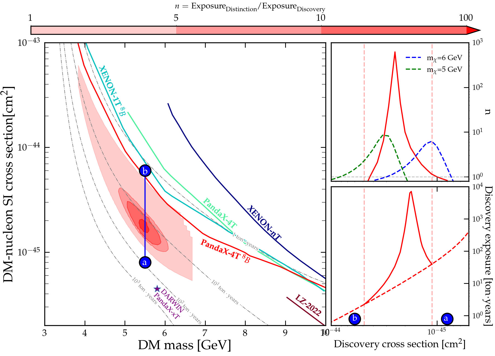

[](https://arxiv.org/abs/24xx.xxxxx)
[](https://opensource.org/licenses/mit-license.php)
[](https://hub.ovh2.mybinder.org/user/zhangblong-distinctionlimit-vodgpat3/lab)

# Distinction
This is the codes for reproducing results from our paper arXiv:[24xx.xxxxx]. You can simply run the notebooks. Most computations can be done within 15 minutes.


We organize four files to content different materials:
* [`src/`] - Contains functions used in producing  results
* [`plots/`] - Contains all the plots in pdf and png formats
* [`notebooks/`] - Jupyter notebooks for obtaining and plotting results
* [`data/`] - data files, including neutrino fluxes, experimental exclusion limits, and the MC data

All classes and functions we use to derive results in our paper are maily included in [`src/`]:
* [`LabFuncs.py`] - Various utilities (from Ciaran's code)
* [`Params.py`] - Some useful parameters and functions (from Ciaran's code)
* [`WIMPFuncs.py`] - Functions needed to calculate WIMP rates (based on Ciaran's code)
* [`propagation.py`] - A class to compute the neutrino propagation from the sun to the Earth
* [`U1Funcs.py`] - Functions needed to calculate neutrino rates w/wo new physics
* [`U1PlotFuncs.py`] - Plotting functions
* [`StatisticFuncs.py`] - Main classes and functions
Here, we also provide a code diagram for better understanding:


Bases on materials above, we offer several notebooks to obstain figures in our paper:
* [`Spectrum.ipynb`] - Figures 1
* [`DM-N.ipynb`] - Figures 2 & 4
* [`DM-e.ipynb`] - Figure 3 & 4
* [`Exclusions.ipynb`] - Figure 5
* [`Different DM-N.ipynb`] - Figure 6
* [`Different DM-e.ipynb`] - Figure 6
* [`MCPlot.ipynb`] - Figure 7
---
# Attention
Our work is based on the reference arXiv: 2304.13665 and the repository [`zhangblong AsymptoticAnalysisAndNeutrinoFog`](https://github.com/zhangblong/AsymptoticAnalysisAndNeutrinoFog). And some codes are from [`Ciaran NeutrinoFog`](https://github.com/cajohare/NeutrinoFog/). The codes used to obtain DM-e scattering event rates are from [`T.T. Yu ` QEdark](https://github.com/tientienyu/QEdark).

# Requirements
* [`CMasher`](https://cmasher.readthedocs.io/)
* [`Numba`](https://numba.pydata.org/)
* [`labelLine`](https://github.com/cphyc/matplotlib-label-lines)
---

If you need any further assistance or have any questions, contact me at zhangblong1036@foxmail.com. And if you do use anything here please cite the paper, [Bing-Long Zhang](https://arxiv.org/abs/2304.13665)
```
@article{Tang:2023xub,
    title={Asymptotic Analysis on Binned Likelihood and Neutrino Floor},
    author={Jian Tang and Bing-Long Zhang},
    year={2023},
    eprint={2304.13665},
    archivePrefix={arXiv},
    primaryClass={hep-ph}
}
```
